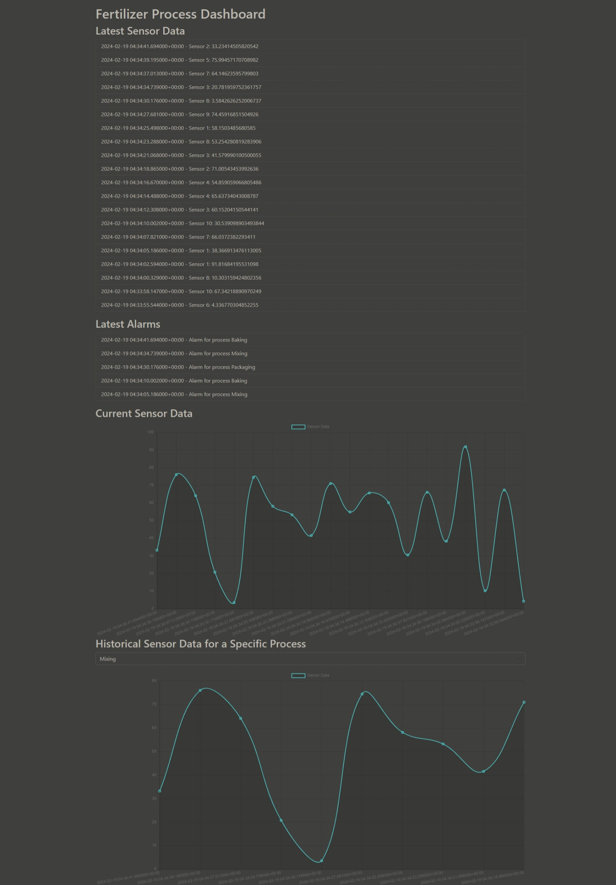

# [FertilizerDataHub](https://github.com/Leptons1618/FertilizerDataHub.git)
Fertilizer Process Industrial Data Management

# Installation
__Create a virtual environment__
```bash
python -m venv venv
```

__Activate the virtual environment__

For Windows:
```bash
venv\Scripts\activate
```
For Linux:
```bash
source venv/bin/activate
```

__Install the required packages__
We'll be using Django, Djongo, and pymongo for this project. Install them using pip:
```bash
pip install django djongo pymongo==3.12.1
```
>Note: Install the pymongo=3.12.1 package to avoid compatibility issues with Djongo.

# Database Configuration
# Djongo Database for MongoDB
```python
DATABASES = {
    'default': {
        'ENGINE': 'djongo',
        'NAME': '<database_name>',
        'CLIENT': {
            'host': 'mongodb+srv://<username>:<password>@<cluster_name>.sknzcx0.mongodb.net/?retryWrites=true&w=majority', # Replace with your MongoDB connection string
            'port': 27017,
            'username': '<username>',
            'password': '<password>',
        }
    }
}
```

Here's a breakdown of the settings:

`ENGINE`: 'djongo': This tells Django to use Djongo as the database engine. Djongo translates Django ORM queries into queries that MongoDB can understand.

`NAME`: '<database_name>': This is the name of the MongoDB database that Django will use.

`CLIENT`: This is a dictionary containing the details of the MongoDB server.

`host`: 'mongodb+srv://<username>:<password>@<cluster_name>.sknzcx0.mongodb.net/?retryWrites=true&w=majority': This is the connection string for the MongoDB server. It includes the username, password, and the address of the MongoDB server.

`port`: 27017: This is the port number on which the MongoDB server is running.

`username`: '<username>', `password`: '<password>': These are the credentials for the MongoDB server.

# Create application
```bash
python manage.py startapp <app_name>
```

# Define models
```python
from django.db import models

# Process model to represent the different processes in the factory (e.g. Mixing, Baking, Packaging)
class Process(models.Model):
    name = models.CharField(max_length=100)

    def __str__(self):
        return self.name

    class Meta:
        db_table = "process"
        managed = True

class SensorData(models.Model):
    sensor_id = models.AutoField(primary_key=True)
    measurement_value = models.FloatField()
    timestamp = models.DateTimeField(auto_now_add=True)
    process = models.ForeignKey(Process, on_delete=models.CASCADE)
    alarm_status = models.CharField(max_length=100)

    def __str__(self):
        return f"SensorData ID: {self.sensor_id}, Process: {self.process.name}"

    class Meta:
        db_table = "sensor_data"

class Alarm(models.Model):
    timestamp = models.DateTimeField(auto_now_add=True)
    description = models.TextField()
    process = models.ForeignKey(Process, on_delete=models.CASCADE)
    alarm_status = models.CharField(max_length=100)

    def __str__(self):
        return f"Process: {self.process.name}, Alarm: {self.description}"

    class Meta:
        db_table = "alarm"
```
Here we define now three Django models: `Process`, `SensorData`, and `Alarm`.

__Process__:<br>
`Process`: Represents different processes in a factory (like Mixing, Baking, Packaging). It has one field, name, which is a character field with a maximum length of 100.<br>


__SensorData__:<br>
`SensorData`: Represents sensor data for each process. It has the following fields: <br>

`sensor_id`: An auto-incrementing integer that serves as the primary key.
measurement_value: A floating-point number representing the measurement value from the sensor.<br>
`timestamp`: A datetime field that automatically gets set with the current date and time when a sensor data object is created.<br>
`process`: A foreign key field that creates a many-to-one relationship with the Process model. If the related Process object is deleted, all related SensorData objects will also be deleted (on_delete=models.CASCADE).<br>
`alarm_status`: A character field with a maximum length of 100.<br>

__Alarm__: <br>
`Alarm`: Represents alarms for each process. It has the following fields:
<br>

`timestamp`: A datetime field that automatically gets set with the current date and time when an alarm object is created.<br>
`description`: A text field for the description of the alarm.<br>
`process`: A foreign key field that creates a many-to-one relationship with the Process model. If the related Process object is deleted, all related Alarm objects will also be deleted (on_delete=models.CASCADE).<br>
`alarm_status`: A character field with a maximum length of 100.<br>

Each model also has a __str__ method that defines a human-readable representation of the model, and a Meta class that sets additional options for the model. In this case, the db_table option is used to specify the name of the database table for each model.

# Create views
```python
from django.shortcuts import render, get_object_or_404
from django.http import JsonResponse
from .models import SensorData, Alarm, Process

def dashboard(request):
    # Fetch latest sensor data and alarms
    latest_sensor_data = SensorData.objects.all().order_by('-timestamp')[:10]
    latest_alarms = Alarm.objects.all().order_by('-timestamp')[:5]
    
    # Fetch historical sensor data for chart visualization
    historical_sensor_data = SensorData.objects.all().order_by('-timestamp')[:10]

    return render(request, 'dashboard.html', {
        'latest_sensor_data': latest_sensor_data,
        'latest_alarms': latest_alarms,
        'historical_sensor_data': historical_sensor_data,
    })


def get_historical_data(request, process):
    # Get the Process object or return a 404 response if not found
    process_object = get_object_or_404(Process, name=process)

    # Fetch historical sensor data for a specific process (limited to 10 data points for demonstration purposes)
    historical_sensor_data = SensorData.objects.filter(process=process_object).order_by('-timestamp')[:10]

    # Prepare data for JSON response ()
    data = {
        'timestamps': [str(data.timestamp) for data in historical_sensor_data],
        'measurement_value': [data.measurement_value for data in historical_sensor_data],
    }

    return JsonResponse(data)

def get_latest_sensor_data(request):
    # Fetch the latest sensor data
    latest_sensor_data = SensorData.objects.all().order_by('-timestamp')[:20]

    # Prepare data for JSON response
    data = [
        {
            'timestamp': str(sensor_data.timestamp),
            'sensor_id': sensor_data.sensor_id,
            'measurement_value': sensor_data.measurement_value,
        }
        for sensor_data in latest_sensor_data
    ]
    
    # print(data)

    return JsonResponse(data, safe=False)

def get_latest_alarms(request):
    # Fetch the latest alarms
    latest_alarms = Alarm.objects.all().order_by('-timestamp')[:5]

    # Prepare data for JSON response
    data = [
        {
            'timestamp': str(alarm.timestamp),
            'description': alarm.description,
        }
        for alarm in latest_alarms
    ]

    return JsonResponse(data, safe=False)
```
Now let's define four Django view functions:

`dashboard`: Fetches the latest sensor data and alarms, as well as historical sensor data for chart visualization. It then renders a template named 'dashboard.html', passing the fetched data to the template.

`get_historical_data`: Fetches historical sensor data for a specific process. The process name is passed as a parameter in the URL. The fetched data is returned as a JSON response.

`get_latest_sensor_data`: Fetches the latest sensor data and returns it as a JSON response.

`get_latest_alarms`: Fetches the latest alarms and returns them as a JSON response.

Each function uses Django's ORM to query the database. The `order_by('-timestamp')` part sorts the data in descending order by timestamp, and the `[:n]` part limits the number of results to `n`. The filter`(process=process_object)` part in get_historical_data filters the sensor data to only include data for the specified process.

# Create templates
Create a new directory named templates in the app directory. Inside the templates directory, create a new file named dashboard.html and add your html code.
You can use AJAX to fetch the historical sensor data, latest sensor data, and latest alarms from the server and update the dashboard in real-time.
```html
<!-- templates/dashboard.html -->
<!DOCTYPE html>
<html lang="en">
<head>
    <meta charset="UTF-8">
    <meta name="viewport" content="width=device-width, initial-scale=1.0">
    <title>Fertilizer Process Dashboard</title>
    <link href="https://cdn.jsdelivr.net/npm/bootstrap@5.1.3/dist/css/bootstrap.min.css" rel="stylesheet">
</head>
<script src="https://cdnjs.cloudflare.com/ajax/libs/Chart.js/2.9.4/Chart.js"></script>
<body>
    <div class="container">
        <h1 class="mt-3">Fertilizer Process Dashboard</h1>

        <!-- Display latest sensor data asynchronously -->
        <h2>Latest Sensor Data</h2>
        <ul id="latestSensorData" class="list-group mb-3"></ul>

        <!-- Display latest alarms asynchronously -->
        <h2>Latest Alarms</h2>
        <ul id="latestAlarms" class="list-group mb-3"></ul>

        <!-- Visualize the latest sensor data for all processes -->
        <h2>Current Sensor Data</h2>
        <canvas id="CurrentSensorData" width="400" height="200"></canvas>

        <h2>Historical Sensor Data for a Specific Process</h2>
        <select id="processSelector" class="form-select mb-3">
            <option value="Mixing">Mixing</option>
            <option value="Baking">Baking</option>
            <option value="Packaging">Packaging</option>
            <!-- Add more options for other processes as needed -->
        </select>

        <!-- Include JavaScript libraries for charts and interactivity -->
        <canvas id="sensorChart" width="800" height="400"></canvas>
    </div>

    <script>
        document.addEventListener('DOMContentLoaded', function () {
            var ctx = document.getElementById('sensorChart').getContext('2d');
            var ctx2 = document.getElementById('CurrentSensorData').getContext('2d');
            var chart;
            var chart2;

            // Function to fetch and display latest sensor data asynchronously
            function fetchLatestSensorData() {
                fetch('/latest-sensor-data/')
                    .then(response => response.json())
                    .then(data => {
                        // Update the latest sensor data list
                        updateLatestSensorDataList(data);

                        // Update the chart data
                        chart2.data.labels = data.map(sensor => sensor.timestamp);
                        chart2.data.datasets[0].data = data.map(sensor => sensor.measurement_value);

                        // Update the chart
                        chart2.update();
                    })
                    .catch(error => console.error('Error fetching latest sensor data:', error));
            }

            // Function to fetch and display latest alarms asynchronously
            function fetchLatestAlarms() {
                fetch('/latest-alarms/')
                    .then(response => response.json())
                    .then(data => {
                        // Update the latest alarms list
                        updateLatestAlarmsList(data);
                    })
                    .catch(error => console.error('Error fetching latest alarms:', error));
            }

            // Function to update the latest sensor data list
            function updateLatestSensorDataList(data) {
                var latestSensorDataList = document.getElementById('latestSensorData');
                latestSensorDataList.innerHTML = '';  // Clear existing data

                data.forEach(sensor => {
                    var listItem = document.createElement('li');
                    listItem.textContent = `${sensor.timestamp} - Sensor ${sensor.sensor_id}: ${sensor.measurement_value}`;
                    listItem.classList.add('list-group-item');
                    latestSensorDataList.appendChild(listItem);
                });
            }

            // Function to update the latest alarms list
            function updateLatestAlarmsList(data) {
                var latestAlarmsList = document.getElementById('latestAlarms');
                latestAlarmsList.innerHTML = '';  // Clear existing data

                data.forEach(alarm => {
                    var listItem = document.createElement('li');
                    listItem.textContent = `${alarm.timestamp} - ${alarm.description}`;
                    listItem.classList.add('list-group-item');
                    latestAlarmsList.appendChild(listItem);
                });
            }

            // Function to fetch historical sensor data
            function fetchHistoricalData(process) {
                fetch(`/historical-data/${process}/`)
                    .then(response => response.json())
                    .then(data => {
                        // Update chart data
                        chart.data.labels = data.timestamps;
                        chart.data.datasets[0].data = data.measurement_value.map((value, index) => ({
                            x: index,  // Assuming the x-axis represents the index or time
                            y: value,
                        }));

                        // Update the chart
                        chart.update();
                    })
                    .catch(error => console.error('Error fetching historical sensor data:', error));
            }

            // Function to handle process selection
            document.getElementById('processSelector').addEventListener('change', function () {
                var selectedProcess = this.value;
                fetchHistoricalData(selectedProcess);
            });

            // Initial fetch for latest sensor data and latest alarms
            fetchLatestSensorData();
            fetchLatestAlarms();

            // Initial fetch for historical sensor data
            fetchHistoricalData('Mixing');

            // Chart initialization
            chart = new Chart(ctx, {
                type: 'line',
                data: {
                    labels: [],
                    datasets: [{
                        label: 'Sensor Data',
                        borderColor: 'rgba(75, 192, 192, 1)',
                        borderWidth: 2,
                        data: [],
                    }]
                },
                options: {
                    scales: {
                        x: {
                            type: 'linear',
                            position: 'bottom'
                        },
                        y: {
                            type: 'linear',
                            position: 'left'
                        }
                    },
                    animation: {
                        duration: 1000,
                        easing: 'linear',
                    },
                }
            });

            chart2 = new Chart(ctx2, {
                type: 'line',
                data: {
                    labels: [],
                    datasets: [{
                        label: 'Sensor Data',
                        borderColor: 'rgba(75, 192, 192, 1)',
                        borderWidth: 2,
                        data: [],
                    }]
                },
                options: {
                    scales: {
                        x: {
                            type: 'linear',
                            position: 'bottom'
                        }
                    }
                }
            });

            // Fetch latest sensor data and alarms and historical sensor data at regular intervals
            setInterval(function () {
                fetchLatestSensorData();
                fetchLatestAlarms();
            }, 1000);

            setInterval(function () {
                var selectedProcess = document.getElementById('processSelector').value;
                fetchHistoricalData(selectedProcess);
            }, 1000);
        });
    </script>
    <script src="https://cdn.jsdelivr.net/npm/bootstrap@5.1.3/dist/js/bootstrap.bundle.min.js"></script>
</body>
</html>
```

# Freeze the requirements
```bash
pip freeze > requirements.txt
```

# Dockerize the application

## Create a Dockerfile
```Dockerfile
# Use an official Python runtime as a parent image
FROM python:3.12.1

# Set environment variables
ENV PYTHONDONTWRITEBYTECODE 1
ENV PYTHONUNBUFFERED 1

# Set the working directory in the container
WORKDIR /app

# Copy the current directory contents into the container at /app
COPY . /app/

# Install any needed packages specified in requirements.txt
RUN pip install --upgrade pip
RUN pip install -r requirements.txt

# Expose the port that Django will run on
EXPOSE 8000

# Define the command to run on container start
CMD ["python", "manage.py", "runserver", "0.0.0.0:8000"]
```

## Create a docker-compose.yml file
```yaml
version: '3'

services:
  web:
    build: .
    # command: bash -c "python manage.py runserver 0.0.0.0:8000 & python /app/myscripts/generate_mock_data.py"
    command: python manage.py runserver 0.0.0.0:8000
    volumes:
      - .:/app
    ports:
      - "8000:8000"
```

## Build and run the Docker container
```bash
docker-compose up --build
```

# Run the application
```bash
docker-compose up
```

___

# Access the application
Open a web browser and go to http://localhost:8000/dashboard to access the application dashboard.

> Note: If you're running the application in a Docker container, replace localhost with the IP address of the Docker container.
> If you want to upload the docker image to docker hub, you can use the following commands
```bash
docker login
docker tag <image_id> <docker_hub_username>/<image_name>:<tag>
docker push <docker_hub_username>/<image_name>:<tag>
```
> Now you can pull the image from docker hub and run the application using the following command
```bash
docker pull <docker_hub_username>/<image_name>:<tag>
docker run -p 8000:8000 <docker_hub_username>/<image_name>:<tag>
```

# Generate mock data
__Here we'll be using an custom python script to generate mock data for the sensor data and alarms__
```python
import random
import time
from datetime import datetime
from pymongo import MongoClient

def determine_alarm_status(measurement_value, threshold_low_low, threshold_low, threshold_high, threshold_high_high):
    if measurement_value < threshold_low_low:
        return "Low Low"
    elif threshold_low_low <= measurement_value < threshold_low:
        return "Low"
    elif threshold_high_high >= measurement_value > threshold_high:
        return "High"
    elif measurement_value >= threshold_high_high:
        return "High High"
    else:
        return "Normal"

def generate_sensor_data(num_data_points, processes, process_collection, sensor_data_collection, alarm_collection):
    # Define threshold values
    threshold_low_low = 20
    threshold_low = 40
    threshold_high = 80
    threshold_high_high = 90

    for _ in range(num_data_points):
        timestamp = datetime.now()
        sensor_id = random.randint(1, 10)
        measurement_value = random.uniform(0, 100)
        process = random.choice(processes)

        # Determine alarm status based on the measurement value and thresholds
        alarm_status = determine_alarm_status(measurement_value, threshold_low_low, threshold_low, threshold_high, threshold_high_high)

        # Store the process data in the "process" collection (if not already present)
        process_data = {'name': process}
        process_collection.update_one(process_data, {'$setOnInsert': process_data}, upsert=True)

        # Create and save a SensorData instance
        sensor_data = {
            'sensor_id': sensor_id,
            'measurement_value': measurement_value,
            'timestamp': timestamp,
            'process': process,
            'alarm_status': alarm_status
        }
        sensor_data_collection.insert_one(sensor_data)

        # If the alarm status is not "Normal", create an Alarm instance
        if alarm_status != "Normal":
            description = f"Alarm for process {process}"

            alarm_data = {
                'timestamp': timestamp,
                'description': description,
                'process': process,
                'alarm_status': alarm_status
            }
            alarm_collection.insert_one(alarm_data)

            # Print the alarm to the console
            print(f"Alarm: {timestamp} - {description} - Process Name: {process}")

        # Print the sensor data to the console
        print(f"Sensor Data:\n Timestamp: {timestamp} - Sensor ID: {sensor_id} - Measurement Value: {measurement_value} - Process Name: {process} - Alarm Status: {alarm_status}")
        print(f'_________________________________________________________')

if __name__ == "__main__":
    # Connect to the MongoDB database
    mongo_client = MongoClient("<mongodb connection string>")
    db = mongo_client["<database_name>"]

    num_data_points = 1  # The number of data points to generate

    processes = ["Mixing", "Baking", "Packaging"]

    print("Generating mock sensor data and alarms...")
    # Run the script in an infinite loop
    while True:
        try:
            generate_sensor_data(num_data_points, processes, db["process"], db["sensor_data"], db["alarm"])
            time.sleep(2)  # Sleep for 2 seconds

        except KeyboardInterrupt:
            print("Exiting...")
            break
```
Replace the `<mongodb connection string>` and `<database_name>` with your MongoDB connection string and database name.

# Run the script
```bash
python generate_mock_data.py
```

__The script will generate mock sensor data and alarms and store them in the MongoDB database. The script will run in an infinite loop, generating new data every 2 seconds. You can stop the script by pressing Ctrl + C.__


# Conclusion
In this article, we've built a web application for managing fertilizer process industrial data using Django and MongoDB. We've created a Django project and app, defined models, views, and templates, and dockerized the application. We've also created a custom Python script to generate mock sensor data and alarms and store them in the MongoDB database. This application can be used as a starting point for building a more complex industrial data management system.

# Some screenshots of the application


